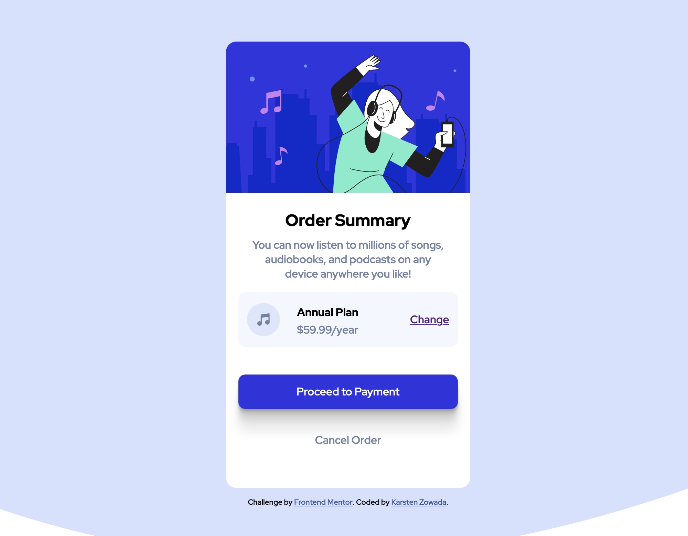

# Frontend Mentor - Order summary card solution

This is a solution to the [Order summary card challenge on Frontend Mentor](https://www.frontendmentor.io/challenges/order-summary-component-QlPmajDUj). Frontend Mentor challenges help you improve your coding skills by building realistic projects. 

## Table of contents

- [Overview](#overview)
  - [The challenge](#the-challenge)
  - [Screenshot](#screenshot)
  - [Links](#links)
- [My process](#my-process)
  - [Built with](#built-with)
  - [What I learned](#what-i-learned)
  - [Continued development](#continued-development)
  - [Useful resources](#useful-resources)
- [Author](#author)
- [Acknowledgments](#acknowledgments)

**Note: Delete this note and update the table of contents based on what sections you keep.**

## Overview

### The challenge

Users should be able to:

- See hover states for interactive elements

### Screenshot

### Links

- Solution URL: [Add solution URL here](https://kzowada.github.io/order-summary-compoment/)
- Live Site URL: [Add live site URL here](https://kzowada.github.io/order-summary-compoment/)

## My process

### Built with

- Semantic HTML5 markup
- CSS custom properties
- Flexbox

### What I learned

With this project I started using rem and em units instead of pixels as before. At first I had to get a grip of how they work but in the end it pays out because the site resize way better because of relative units instead of fixed units. I only used percentages for my widths and min-heigt with vh-Unit. I still didn't have a mobile first approach but with my next project I definitely start with it. I finished the project within a couple hours. The basic HTML was set up pretty fast as well es the look of all the elements. Only positioning took me a couple hours (2-3 hours) to make it look right.

### Continued development

I need to focus on a mobile first approach.

## Author

- Website - [Karsten Zowada](https://www.freecodecamp.org/karsten)
- Frontend Mentor - [@ykzowada](https://www.frontendmentor.io/profile/kzowada)
